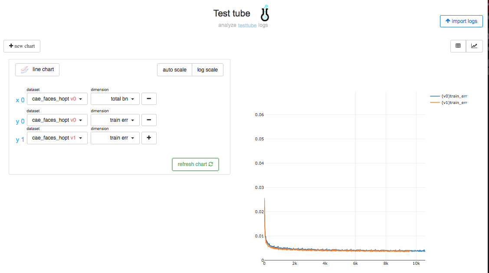

# Test Tube: Easily log and tune Deep Learning experiments

Test Tube allows you to easily log metadata and track your machine learning experiments.

Use Test Tube if you need to:

- Track many [Experiments](experiment_tracking/experiment/) across models.
- [Visualize](http://testtube.williamfalcon.com) and compare different experiments without uploading anywhere.
- [Optimize your hyperparameters](hyperparameter_optimization/HyperOptArgumentParser/) using grid_search or random_search.
- Automatically track ALL parameters for a particular training run.

Test Tube is compatible with: Python 2 and 3

## Getting started

---

### Create an [Experiment](experiment_tracking/experiment/)
```python
from test_tube import Experiment

exp = Experiment(name='dense_model',
                 debug=False,
                 save_dir='/Desktop/test_tube')

exp.add_meta_tags({'learning_rate': 0.002, 'nb_layers': 2})

for step in training_steps:
    tng_err = model.eval(tng_x, tng_y)

    exp.add_metric_row('tng_err': tng_err)

# training complete!
# all your logs and data are ready to be visualized at testtube.williamfalcon.com
```

---
### Optimize your [hyperparameters](hyperparameter_optimization/HyperOptArgumentParser/)
```python
from test_tube import HyperOptArgumentParser

# subclass of argparse
parser = HyperOptArgumentParser(strategy='random_search')
parser.add_argument('--learning_rate', default=0.002, type=float, help='the learning rate')

# let's enable optimizing over the number of layers in the network
parser.add_opt_argument_list('--nb_layers', default=2, type=int, tunnable=True, options=[2, 4, 8])

# and tune the number of units in each layer
parser.add_opt_argument_range('--neurons', default=50, type=int, tunnable=True, start=100, end=800, nb_samples=10)

# compile (because it's argparse underneath)
hparams = parser.parse_args()

# run 20 trials of random search over the hyperparams
for hparam_trial in hparams.trials(20):
    train_network(hparam_trial)
```

---
### [Visualize](http://testtube.williamfalcon.com) results and compare across arbitrary trials



